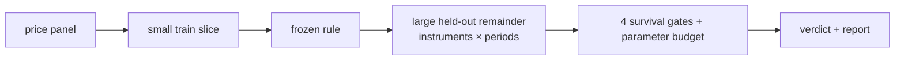

# holdout-first

[](https://github.com/bmouler/holdout-first/actions/workflows/ci.yml)


[](LICENSE)

A validation harness that fits a strategy on a small slice of history and demands that it survive the large remainder, across multiple instruments and multiple disjoint periods, under a hard budget on free parameters.

The conventional split fits on roughly 70% of history and validates on the other 30%. That hands the majority of the evidence to the step most prone to self-deception, and leaves a held-out set small enough that one benign stretch of market can carry it. This library inverts the ratio and adds the checks that a single split cannot make: it verifies that the strategy is actually causal, it counts the parameters against the trades that paid for them, and it demands consistency rather than a single impressive number. The failure mode it prevents is the one that shows up in production as a strategy that worked beautifully right up to the day it was funded.

## Install

```sh
python -m pip install holdout-first
```

For editable development with the test and quality tooling:

```sh
python -m pip install -e ".[dev]"
```

Python 3.11 or newer is required, and `numpy` is the only runtime dependency.

## Quickstart

The demo builds a synthetic panel from a seed and runs three reference strategies through the same harness: an honest one-parameter momentum rule, a 128-parameter lookup table fitted to the training segments, and a rule that reads the next bar.

```
holdout-first demo --seed 11
```

```
holdout-first demo (seed 11)

1. honest strategy: one free parameter, a momentum lookback

holdout-first report: MomentumRule
  declared parameters : 1
  instruments         : 5 (SYN_00, SYN_01, SYN_02, SYN_03, SYN_04)
  walk-forward periods: 3
  train fraction      : 0.30 (held out 0.70)
  embargo gap         : 5 bars
  periods per year    : 252
  fees per turnover   : 0

  instrument     period  train_shp  test_shp  test_ret  test_mdd  test_trd
  SYN_00              0      0.732     0.605     0.202     0.166        58
  SYN_00              1      0.381     0.070     0.002     0.273        66
  SYN_00              2      1.505     0.490     0.170     0.164        69
  SYN_01              0      1.628     0.430     0.131     0.193        52
  SYN_01              1      0.320     1.682     0.743     0.147        47
  SYN_01              2     -0.285    -0.312    -0.121     0.233        76
  SYN_02              0      2.377     1.124     0.449     0.173        42
  SYN_02              1      2.563     0.858     0.321     0.121        48
  SYN_02              2      1.299     0.127     0.023     0.155        60
  SYN_03              0     -0.132     0.902     0.359     0.164        55
  SYN_03              1      1.368    -0.787    -0.254     0.430        91
  SYN_03              2      0.008    -0.490    -0.173     0.310        79
  SYN_04              0     -0.335     0.930     0.353     0.124        70
  SYN_04              1      0.656     1.453     0.617     0.165        65
  SYN_04              2      0.133     1.225     0.508     0.146        60

  rules
  [pass] causality             prefix-invariance held on all 5 instrument(s)
  [pass] parameter_budget      pass: 385 trades / 1 parameters = 385.00 per parameter (need 50, i.e. 50 trades)
  [pass] test_sharpe_positive  12/15 held-out cells have a positive Sharpe (0.800), need 0.667
  [pass] sharpe_retention      mean held-out Sharpe 0.554 against mean training Sharpe 0.815 is a retention of 0.680, need 0.500

  verdict: SURVIVED

2. overfitted strategy: a 128-entry lookup table fitted to the training segments

holdout-first report: OverfittedLookup
  declared parameters : 128
  instruments         : 5 (SYN_00, SYN_01, SYN_02, SYN_03, SYN_04)
  walk-forward periods: 3
  train fraction      : 0.30 (held out 0.70)
  embargo gap         : 5 bars
  periods per year    : 252
  fees per turnover   : 0

  instrument     period  train_shp  test_shp  test_ret  test_mdd  test_trd
  SYN_00              0      1.405     1.112     0.426     0.080       361
  SYN_00              1      0.424    -0.468    -0.173     0.226       343
  SYN_00              2      0.577    -0.262    -0.115     0.207       326
  SYN_01              0      0.630     1.453     0.586     0.073       340
  SYN_01              1      1.520     0.621     0.212     0.116       340
  SYN_01              2      0.653     0.883     0.326     0.110       332
  SYN_02              0      1.684     0.089     0.009     0.272       353
  SYN_02              1      2.923    -0.982    -0.307     0.347       361
  SYN_02              2      1.027     1.194     0.474     0.107       341
  SYN_03              0      1.619    -0.919    -0.304     0.347       359
  SYN_03              1      1.411    -1.042    -0.317     0.411       362
  SYN_03              2      2.966    -0.026    -0.030     0.207       335
  SYN_04              0      1.097     0.437     0.140     0.255       326
  SYN_04              1      1.614    -0.008    -0.024     0.217       317
  SYN_04              2      0.698    -0.644    -0.222     0.314       352

  rules
  [pass] causality             prefix-invariance held on all 5 instrument(s)
  [FAIL] parameter_budget      fail: 2133 trades / 128 parameters = 16.66 per parameter (need 50, i.e. 6400 trades)
  [FAIL] test_sharpe_positive  7/15 held-out cells have a positive Sharpe (0.467), need 0.667
  [FAIL] sharpe_retention      mean held-out Sharpe 0.096 against mean training Sharpe 1.350 is a retention of 0.071, need 0.500

  verdict: REJECTED (failing rules: parameter_budget, test_sharpe_positive, sharpe_retention)

3. non-causal strategy: reads the next bar

  LookaheadError raised: look-ahead detected at bar 1049: the strategy returned 0.0 when shown the first 1050 bars but -1.0 when shown the full series. A causal strategy cannot revise a past position after seeing future data.
  first divergent bar: 1049 (prefix length 1050, prefix said 0, full series said -1)

outcome: the parsimonious rule survived, the overfitted rule was rejected, and the peeking rule never reached a performance number.
```

`holdout-first demo --json` prints the same content as a JSON document. The command exits 0 only when all three strategies behave as documented, so it doubles as a smoke test.

Your own strategy is any object with an `n_parameters` attribute and a `positions(prices)` method:

```python
import numpy as np

from holdout_first import evaluate
from holdout_first.synthetic import make_panel


class BreakoutRule:
    """Long at a new lookback high, short at a new low, otherwise hold."""

    def __init__(self, lookback: int) -> None:
        self.lookback = lookback
        self.n_parameters = 1  # count every value you chose by looking at data

    def positions(self, prices: np.ndarray) -> np.ndarray:
        out = np.zeros(prices.size)
        for t in range(self.lookback, prices.size):
            window = prices[t - self.lookback : t + 1]  # trailing only: causal
            if prices[t] >= window.max():
                out[t] = 1.0
            elif prices[t] <= window.min():
                out[t] = -1.0
            else:
                out[t] = out[t - 1]
        return out


report = evaluate(BreakoutRule(lookback=30), make_panel(seed=11), n_periods=3, gap=5)
for rule in report.rules:
    print(f"{'pass' if rule.passed else 'FAIL'}  {rule.name:<20} {rule.detail}")
print("survived:", report.survived)
```

```
pass  causality            prefix-invariance held on all 5 instrument(s)
pass  parameter_budget     pass: 97 trades / 1 parameters = 97.00 per parameter (need 50, i.e. 50 trades)
pass  test_sharpe_positive 10/15 held-out cells have a positive Sharpe (0.667), need 0.667
pass  sharpe_retention     mean held-out Sharpe 0.520 against mean training Sharpe 0.746 is a retention of 0.696, need 0.500
survived: True
```

## How it works


`evaluate(strategy, panel)` runs a strategy once per instrument on the full price series, slices the resulting position path into walk-forward train and test segments, and applies four rules. A strategy survives only if all four pass, and each one reports its own verdict with the numbers behind it.

**Splitting.** Each instrument is cut into `n_periods` disjoint contiguous blocks. Inside every block the first `train_fraction` of the bars is the training range, the next `gap` bars are discarded, and the rest is held out. Nothing is shuffled, because shuffling a price series produces a test set interleaved with the training data. `train_fraction` defaults to `0.30`, and a value above `0.5` raises unless you pass `allow_large_train=True`. The `gap` is an embargo: a feature computed from a trailing window at the last training bar reads the same prices as a feature at the first test bar, so without it the two sides share observations. Set it to at least the longer of your feature window and your label horizon.

**Causality.** `assert_causal` runs the strategy on the full series and again on truncated prefixes at 35%, 60%, and 85% of its length, then compares bar by bar. If a strategy is causal, its position at bar `t` cannot change when bars after `t` are appended. A centred moving average, a full-sample z-score, a backward fill, or a label built from `prices[t + 1]` all break that invariance, and the check raises `LookaheadError` naming the first bar that moved. This is a falsifier, not a proof: a rule that peeks only at the final bar of the series has no future to peek at during a truncated run and will pass.

**Parameter budget.** Every free parameter is another axis along which noise can be fitted, so the configuration must earn its parameters with observations, and the observation that counts for a trading rule is a trade rather than a bar. The rule is one inequality: trades observed in the training segments divided by the declared parameter count must reach `min_trades_per_parameter`, which defaults to 50. It is blunt on purpose. Its one weakness is that you declare `n_parameters` yourself, and understating it deceives nobody but you.

**Survival.** Two rules operate on the grid of instrument-period cells. `test_sharpe_positive` requires a positive held-out Sharpe in at least a supermajority of cells, two thirds by default, because consistency across instruments and periods is the evidence and a single spectacular cell is not. `sharpe_retention` requires the mean held-out Sharpe to be at least half the mean training Sharpe; a non-positive training Sharpe fails the rule outright, since there is nothing to retain. Some decay is normal, and a collapse means the training figure was describing the sample rather than the process.

**Metrics.** Every statistic is a pure function on a numpy array, and every convention is written in its docstring: simple returns rather than log returns, geometric compounding, sample standard deviation with `ddof=1`, and a single `sqrt(periods_per_year)` scaling with no autocorrelation adjustment. `max_drawdown` returns a non-negative magnitude. `periods_per_year` is always explicit. Transaction costs default to `0.0` and, when set, are charged per unit of turnover.

## Verification

### End-to-end performance

`PYTHONPATH=src python benchmarks/benchmark_evaluate.py --json --samples 101 --warmups 5`
times the documented `evaluate(MomentumRule, panel).to_dict()` path across 24 instruments,
20,000 bars, and three walk-forward periods. Panel generation and interpreter startup are
excluded; validation, four causality runs per instrument, returns, metrics, survival rules, and
all 72 materialized cells are included. Sufficiently large metric batches use at most four
worker threads.

On an Apple M3 Max with CPython 3.11.12 on 2026-08-15, three independent paired
trials against frozen baseline `0e6253c1e0df` measured **22.133 / 6.987 ms
(3.168x)**, **22.000 / 6.975 ms (3.154x)**, and **22.114 / 6.983 ms (3.167x)**
baseline/current medians. Every timed run produced SHA-256
`b97c08eeec26c31a91bae5d15f991fc52c364066e30ebce4c9d0b3fc4da1c379`. These are local
in-process timings; rerun on the target machine, using `PYTHONPATH` to select the source
worktree being measured.

### Mutation testing

From the repository root, reproduce the mutation run with:

```sh
source .venv/bin/activate
mutmut run
mutmut results
```

The run generated 1,650 mutants and killed 1,430 (86.67%). The other 220 were explicitly skipped after individual review established that they are behavior-equivalent under the documented contract; they are not missed surviving mutants.

| Reviewed equivalent rationale | Count |
|---|---:|
| Dtype, default, or cast changes with identical observable behavior | 67 |
| Wording or presentation changes outside the asserted contract | 56 |
| Explicit defaults equivalent to the existing implicit defaults | 25 |
| Unreachable defensive branches | 22 |
| Degenerate numeric substitutions with identical results | 19 |
| Alternate paths for inputs already rejected as invalid | 17 |
| Sentinel or warmup substitutions with identical behavior | 14 |
| **Total explicitly skipped equivalents** | **220** |

There were zero surviving, timed-out, or suspicious mutants.

## Limitations

- The prefix-invariance test cannot prove causality. It falsifies the common mistakes, and a leak confined to the last bars of the series will slip through.
- Survival on a given panel is not evidence about a different panel, a different frequency, or a different market regime. The harness reports what the held-out data said; it does not extrapolate.
- The thresholds are conventions, not theorems. Two thirds of cells positive, half the training Sharpe retained, and fifty trades per parameter are defensible round numbers that happen to be hard to argue with. They are all arguments to `evaluate`.
- The verdict is sensitive to the panel. Running the demo across seeds shows the honest rule failing `sharpe_retention` on some of them, because a real but modest edge measured on fifteen cells is still a noisy measurement. That sensitivity is the point rather than a defect, but it means one `survived=True` is a filter passed, not a result established.
- Cell statistics are computed segment by segment, and each segment is measured as if it were entered flat. This charges the opening position of each segment as one trade and a little turnover.
- `n_parameters` is self-declared. A configuration selected by trying two hundred variants and keeping the best has spent far more degrees of freedom than the surviving variant's arity suggests.
- Every instrument in a panel must have the same number of bars, so ragged histories need to be aligned or trimmed before evaluation.
- The synthetic price process is a toy: an AR(1) drift buried in independent Gaussian noise. It exists so the examples are reproducible without data files, and it is not a market model.

## Non-goals

- **Not a backtesting engine.** There is no order matching, no slippage model, no borrow cost, no financing, no position sizing, and no portfolio construction. The only price arithmetic in the library turns a position path into a return series.
- **Not a strategy library.** The three reference strategies exist to demonstrate the harness and are deliberately trivial. None has ever been traded.
- **Not a data layer.** Nothing here fetches, caches, cleans, or aligns data. A panel is a dict of numpy arrays that you supply.
- **No multiplicity testing, ever.** No probability of backtest overfitting, no deflated Sharpe ratio, no Bonferroni, no false discovery rate, no reality check. This is a deliberate design position: the answer to a large search is a large held-out set evaluated across instruments and periods, not a p-value adjusted after the fact.
- **No optimiser.** The library never fits your parameters. Whatever fitting a configuration embodies happened before it was handed over, which is what makes the held-out numbers mean anything.
- **No plotting, no reporting stack, no pandas.** `Report.format_text()` and `Report.to_dict()` are the whole output surface.

## License

MIT. See [LICENSE](LICENSE).